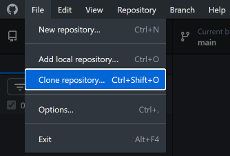
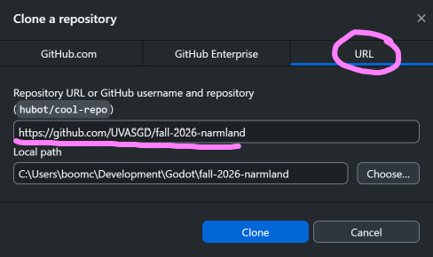
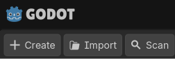
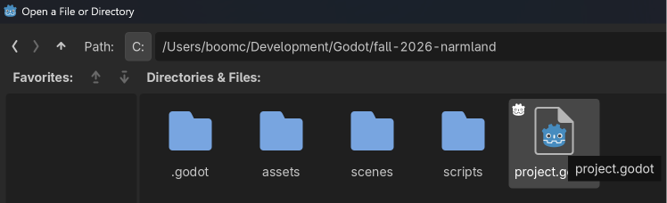
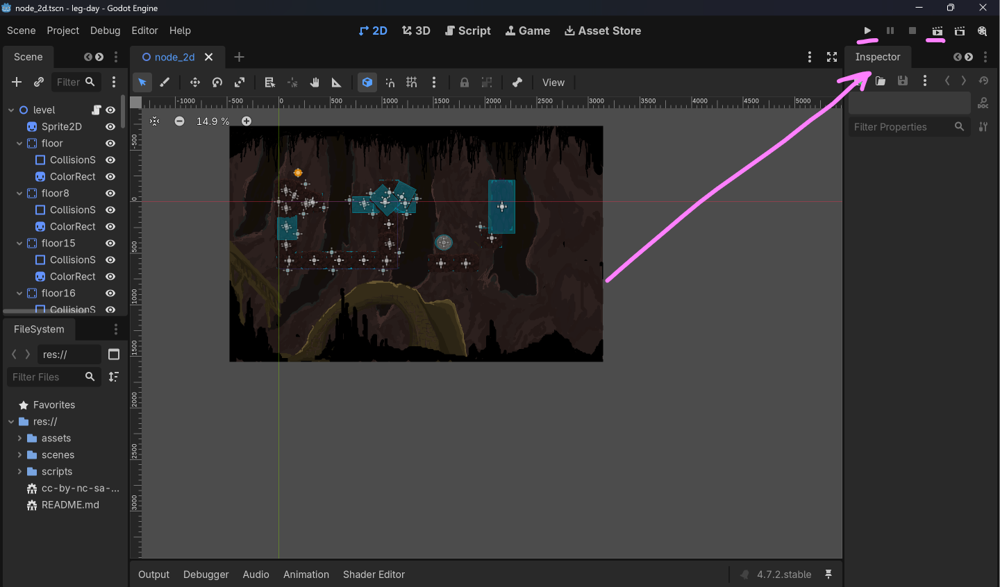
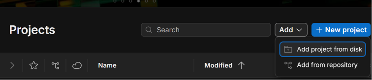
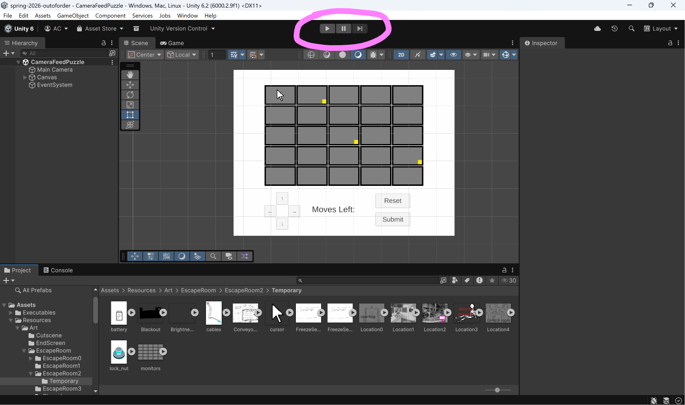
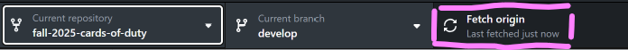
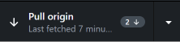

### Git/GitHub Guide for Artists and Non-Technical Backgrounds

## *"what is a github im not a programmer. why do i care?"*

If you're an artist, musician, or other creative person, you'll usually just be uploading
your work to Google Drive or some other platform, then someone else will put it in the game
for you.

I myself am not an artist, but it feels strange that assets are put in the game, then artists
will only really get to see them through videos programmers make or in the final game build.

Why not be able to run the game yourself and see your assets in action? I think that's really
valuable especially during the game's development, so you can comment on whether that's what
you intended!

This guide will help you grab your video game project from the internet, and update it when you
need to!

## GitHub Desktop

The project that you're working with is likely hosted on an external website called GitHub,
unless you're working in a very different game engine (e.g. Roblox Studio)

Go ahead and download [GitHub Desktop](https://github.com/UVASGD/sgd-docs)

You will be making a copy of the game project and storing it on your personal computer.
What GitHub Desktop does is check and let you update the project (pulling new changes)

## How to download and open the project

### Step 1: Finding the link to the project *repository*

The link should look something similar to `https://github.com/USERNAME/PROJECT_NAME`, for example,
https://github.com/UVASGD/spring-2025-lucid-nightmares. 
Ask a director or someone else if you're not sure.

Please note that if you're just copying the project to your computer, you **will NOT** need 
a GitHub account.

### Step 2: Cloning the project in GitHub Desktop

Open GitHub Desktop.

In the top-left, click **File -> Clone Repository**.
Then in the menu that appears, click the **URL** tab 
and enter the repository link you found in Step 1.

The **Local Path** specifies where the project files will live on your computer.

Once you're done click **Clone** and GitHub Desktop will download the project.

### Step 3: Opening your project in the game engine

This will depend on what game engine the team is using.

**Godot**

For Godot, first figure out which version of Godot the team is using. If you don't know you can
always just default to the latest version.

Download Godot at https://godotengine.org/

Extract it and open, then click "Import" in the top left.

Find where GitHub Desktop downloaded the project, then double-click the `project.godot` file.

Then you should be in! To run the project you can click the play button in the top right, but you
may need to reach out to someone in order to run the right scene, especially if the game is still
undergoing development.

**Unity**

Download Unity at https://unity.com/download. You'll have to make an account.
*Installation takes a while!*

Once you can load up the Unity Hub, click Add -> Add Project from disk

Locate the folder with the project that GitHub Desktop downloaded, 
then click "Open" with it highlighted.

Click on the project if it doesn't open automatically, but then you should be in!
To run the project you can click the play button at the top, but you might need
to reach out to someone in order to run the right scene, especially if the game is still
undergoing development.

## Keeping your project up to date

So you can open the game and run it? That's great!

But when someone updates the project on GitHub, you'll need to **pull** the changes from the Internet.

This is done in two clicks.
Head back to **GitHub Desktop**, select the correct repository, and click **Fetch Origin**

If nothing happens to the button then your project is up to date. But if there is something new
that your copy of the game doesn't have yet, then it will change to **Pull Origin**

Click that and your project will automatically be updated!

## Other things

I won't cover making changes to the project and pushing it to GitHub here.
If you're interested in that, you might want to see the [other guides on Git](index.md),
or the [official documentation on GitHub Desktop](https://docs.github.com/en/desktop/overview/getting-started-with-github-desktop).

Good luck!