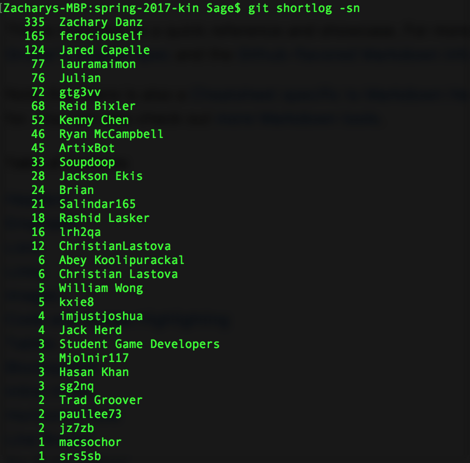

# Rewriting History: Git Authorship

Having issues with your git history? Perhaps you're not finding that you're credited with commits you believe that you should. This can be caused by a number of issues --perhaps your email is wrong on github, or incorrectly set in your local .git file. There are actually loads of reasons why this might be messed up, and while you should fix that --this guide is only going to teach you how to rewrite this evil, not how to prevent it. 

The first thing we should do is learn a couple of helpful commands that will show us what needs to be fix and indicate our progress.

### A Couple of Helpful Commands

These must be performed inside of the repository about which you wish to glean information.

1. `git shortlog -sn` This command will show the number of commits and author name sorted from most to least commits as shown below:

2. `git log --pretty="%an %ae%n%cn %ce | sort | uniq` This command will show all of the known name and email tuples from commits and sort them alphabetically. This way, you can see which emails need to be replaced. An example is below:

### How to Rewrite History

1. Clone the git repo you intend to rewrite
2. cd into that repo
3. Download [this shell script](https://gist.github.com/SGDatUVA/c799ed204a7102858e1700595a03343b)
4. Open that shell script and replace what `OLD_EMAIL`, `CORRECT_NAME`, and `CORRECT_EMAIL` are equal to so that the script will accomplish the change you desire. Refer to the earlier helpful commands if you are unaware of the old email.
5. Save your changes and commit the new shell script into your repository; funny enough, you will be unable to run it if there are unstaged or uncommited changes
6. Run the shell script with the command `sh name.sh` where name is the name of the script
7. Wait for that to finish
8. To make those changes official, use the command `git push --force --tags origin 'refs/heads/*'` (By the way, these changes won't apply to protected branches)
9. Wait again
10. To remove the old history, use the command `git filter-branch -f --index-filter 'git rm --cached --ignore-unmatch Rakefile' HEAD`
11. Wait again again
12. Now you're done! Repeat steps 4 through 11 as necessary to change all the history you desire and then...
13. Delete the shell script from your repo and commit that delete 

When you're done, you should see a change in the output of the helpful commands. For example, the first of the helpful commands will show a change in the number of commits attributed to the user you are not applying them to. See the image below and compare it to the one above, paying special attention to the user Zachary Danz:

[Back](./index.md)
