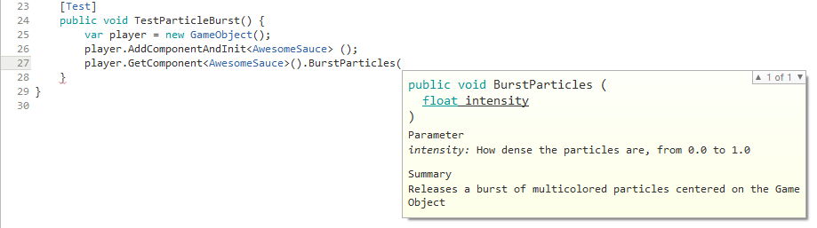

# Unity: Tips on Code Documentation

This article offers some pointers on documenting a codebase within Unity. The [last section](#unity-inspector-customization) generalizes documentation to validation and organization as well. This post assumes that you are using C#, though the same principles apply for other languages.

## Naming Conventions

Before you begin writing code it is worth spending a little thought on how things (classes, functions, fields, even local variables) should be named. There are no hard and fast rules for this, but if you develop a policy early, then you will be thankful months later when you try to understand the code. With that said, here are a few points about naming that are highly encouraged, because they are widely adopted:

* Classes and methods are PascalCase (i.e. every first letter of a word is uppercase)
* Fields and variables are camelCase (i.e. the first letter of the first word is lowercase, but subsequent first letters are uppercase)
* Boolean getters/properties take the form of yes/no questions (e.g. `IsFlying`, `CanMove`)
    * Check out [Accessors in C#](https://msdn.microsoft.com/en-us/library/aa287786(v=vs.71).aspx) for the proper way to implement getters and setters
* Private fields may be distinguished from public fields by prefixing with an underscore (e.g. `_health`) or `m` (e.g. `mHealth`)
* Avoid abbreviations in variable names, though sometimes abbreviating the last word may make sense (e.g. use `myGameObject` or `myGameObj`, but not `mGO`)

## XML Documentation

C# uses [XML Documentation](https://docs.microsoft.com/en-us/dotnet/articles/csharp/programming-guide/xmldoc/xml-documentation-comments) for its code -- if you include comments in XML, then your IDE can read them and display them back to you in a meaningful way when you need to refer to methods or classes. Many IDEs will create skeleton XML for you when you type three consecutive forward slashes on the line above a method or class declaration.

Below is an example function signature with XML Documentation prepended to it.

```
/// <summary>
/// Releases a burst of multicolored particles centered on the GameObject
/// </summary>
/// <param name="intensity">How dense the particles are, from 0.0 to 1.0</param>
void BurstParticles(float intensity) 
```

Now, viewing this function from the IDE's code completion module will display the XML we just wrote.



When multiple people collaborate on the same codebase, XML Documentation becomes a powerful tool. It is recommended that you develop a policy for always documenting classes and certain methods; some methods, such as getters and setters, will be so mundane that they are not worth documenting, but in most cases small summaries will help developers understand the code more quickly. XML Documentation can also be used for fields, though tooltips (read on) may be a more useful option.

## Unity Inspector Customization

So far, we have discussed documenting C# code without mentioning Unity. However, the Unity API does provide mechanisms for documenting, validating, and organizing scripts in a way that makes them more usable by the Unity Editor (specifically, the inspector). Below is a list of some attributes that serve this purpose.

* [`Tooltip`](https://docs.unity3d.com/ScriptReference/TooltipAttribute.html): Not only documents public fields in the code itself but also shows others using the script in the inspector (e.g. designers who may not be familiar with the code) how those fields are used.
* [`Range`](https://docs.unity3d.com/ScriptReference/RangeAttribute.html): Restricts the range of int or float values that a field can have; quite useful if you have well-defined minima and maxima for a script. The attribute will cause a slider to render in the inspector.
* [`Multiline`](https://docs.unity3d.com/ScriptReference/MultilineAttribute.html) and [`TextArea`](https://docs.unity3d.com/ScriptReference/TextAreaAttribute.html): Customize how a string field is rendered in the inspector. Both allow for long strings with line breaks; `TextArea` shows a vertical scrollbar while `Multiline` does not. While there are valid use cases for long string fields, you may want to consider [Text Assets](https://docs.unity3d.com/Manual/class-TextAsset.html) for that purpose.
* [`RequireComponent`](https://docs.unity3d.com/ScriptReference/RequireComponent.html): Enforces that a `GameObject` with the attribute's behavior must also have the component specified by the attribute. This is useful for scripts that rely on other components existing on the object (e.g. a player control script that adjusts rigid body physics).
* [`DisallowMultipleComponent`](https://docs.unity3d.com/ScriptReference/DisallowMultipleComponent.html): Enforces that the attribute's behavior cannot be added multiple times to the same object. For many scripts, we only expect a component to be attached exactly once to an object, so this is a simple way to enforce that.
* [`ContextMenu`](https://docs.unity3d.com/ScriptReference/ContextMenu.html) and [`ContextMenuItem`](https://docs.unity3d.com/ScriptReference/ContextMenuItemAttribute.html): Associate custom context menu items with scripted callbacks. To open the context menu, right click on the script name (for `ContextMenu`) or field name (for `ContextMenuItem`) in the inspector. There aren't too many use cases for the context menu, but it may be handy if a certain script has multiple configuration states that you want to switch between quickly.
* [`Header`](https://docs.unity3d.com/ScriptReference/HeaderAttribute.html): If scripts have a handful of fields which can be logically grouped, this will display a header in the inspector (_Note_: sometimes many fields indicate that too much work is being given to one script; the better solution is to refactor independent behaviors into multiple scripts).
* [`HideInInspector`](https://docs.unity3d.com/ScriptReference/HideInInspector.html): Sometimes scripts may need to expose public fields to other scripts programmatically without being exposed in the Unity Editor (_Note_: often such public fields can be refactored as private fields with accessor methods) -- adding this attribute will ensure the field does not show up in the inspector.

Many of these attributes are simple to set up and require little maintenance after the fact -- you just need to remember to keep using them consistently, and your scripts will become much more usable.

[Back](./index.md)
