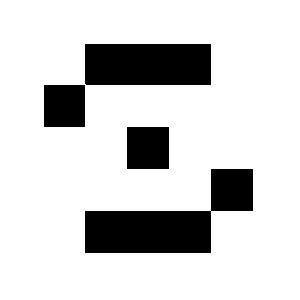
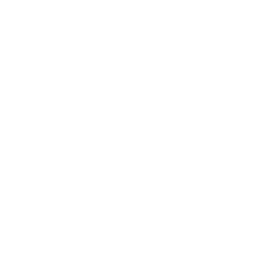
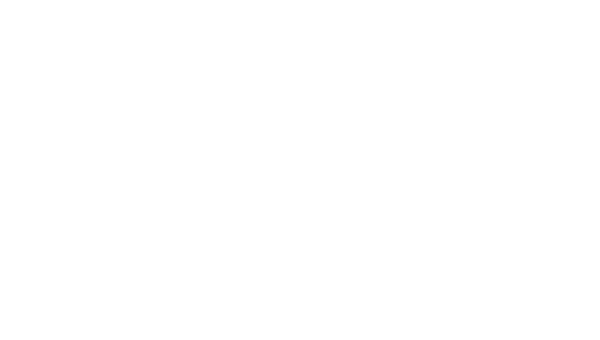
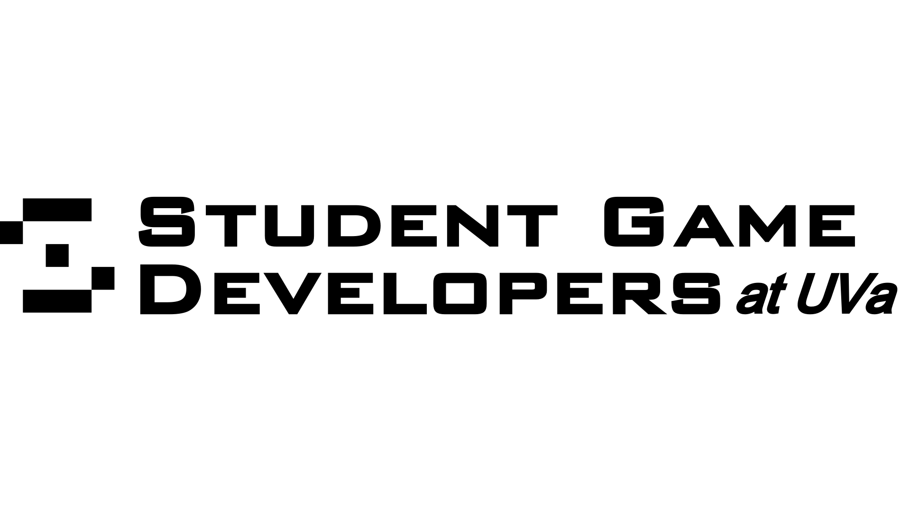
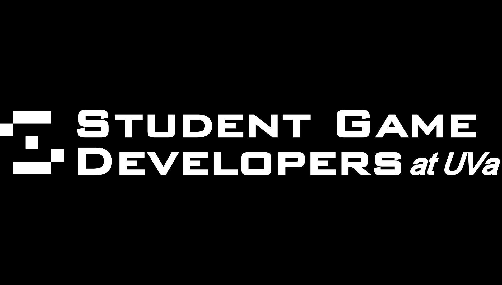
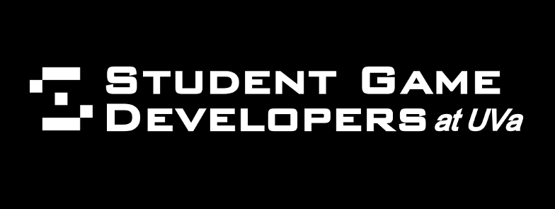

# Branding for SGD at UVA

Some general guidelines follow:

* SGD at UVA must always be presented as "SGD at UVA" or "Student Game Developers at the University of Virginia" or some derivative.
* SGD at UVA may **not** be referred to as UVA SGD for any official purposes. In order to do this, SGD at UVA will have to achieve special status with the university.
* All uses of any SGD at UVA branding must support one of the following logos in a recognizable context.
* The official font of SGD is Morris Sans Com Heavy; similar fonts include Merriweather Sans, Morris Sans Medium, and FF QType Square.

##### Square Logos

##### Long Logo with Title

##### Facebook

[Back](./index.md)
