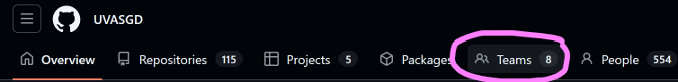

GitHub Classroom was [discontinued](https://github.com/orgs/community/discussions/205975), so while
we wait for an alternative, here are instructions on how to do everything manually.

# Directors: Giving people permission to push to your repo

*Please note that with either of these methods, your members will receive an email prompting
them to accept an invitation.*

## Preferred method

You should have a repository already set up for you under the UVASGD organization.

A "team" has been created for you under the organization, and is set up in a fashion that lets
anyone on that team push to your repository.

- Go to the organization: https://github.com/UVASGD
- Click "Teams" in the navigation bar under the name: 
- Find your team name and click it
- Click "Add a member" and enter your member's GitHub username

## Alternative method

If for some reason you can't add members to your team or your team doesn't exist, first contact
your head of directors, but if you want to and have full control of your repository, 
you may add your members directly.
- Go to your repository
- Click settings in the navigation bar under the name
- Click "Collaborators"
- Add your members

# Directors: Cloning your repo into your new repo under UVASGD

##
If you don't care about

# Future Head of Directors: