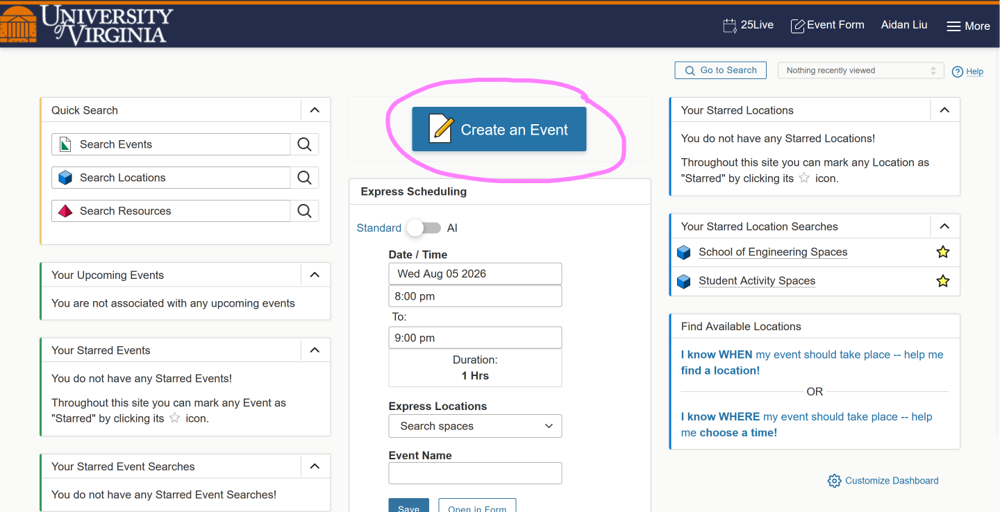
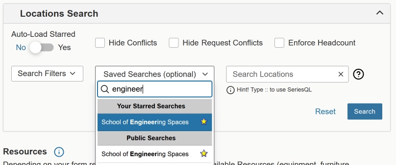

# Booking Space

*Last updated 8/6/2026*

## Where?

* For the E-School (Thornton, Mec., Wilson), Nau/Gibson, Clark lecture halls, see [25Live](#booking-through-25live)
* For Rice Hall, see [Rice](#booking-in-rice)
  * For Newcomb Hall spaces, Ern Commons, or larger events, see [Event Planning Officer](#booking-through-newcomb-event-planning-services)
* For any Library spaces such as Library conference rooms, see [Library](#booking-at-a-library)

## Booking through 25Live

<small>Is 25Live better than what UVA used before, called *The Source*? We may never know...</small>

You will need to book rooms at least **3 days** in advance, so plan accordingly.

- Follow this [link](https://25live.virginia.edu/)
  - This page has some general information on 25Live, read if you wish
- Click any button that says **25Live Login**
- Authenticate with NetBadge
- Click the large *Create an Event* button

This will send you to the event form.

- Select the date and time for your event
  - Be sure to click on the first date field and NOT the repeating pattern calendar.
  - If you do want to set a repeating pattern, note that certain locations do not allow this (some classrooms)
  - If so, you will have to book the same place every week.
- Select event type (usually Meeting)
- Select **STUDENT GAME DEVELOPERS** as the organization
- Provide a headcount (can estimate, does not need to be exact)
- Write a short description
- Select a location
  - Use the Saved Searches bar to search for specific buildings, as it comes with a few presets.
  - If that's not helpful, use the filters to the left of that.
  - **If you cannot see a certain room, you may not be able to reserve it. 
  For example, only Engineering students may reserve Olsson Hall.**

Agree to the conditions, then click **Save** in the bottom right corner.

Your event will then be sent to the scheduler (for Engineering, Cathy Dean, <cld@virginia.edu>) for review. 
**Check your email!** The scheduler may occasionally email you if an event needs to be moved, etc.
<small>One time they asked me to reserve a smaller room because of the low headcount...</small>

## Booking in Rice

As of August 6, 2026, I do not have updated instructions for booking in Rice.

Instructions from March 2017

* So you're going to go to the 5th Floor of Rice Hall and take a right out of the elevators. Then, the office is straight ahead. They're open during normal business hours (8AM - 5PM)
* Talk to a secretary there about reserving a room, and tell them it's for Student Game Developers
* They have some weird, stupid, and arbitrary rules about reservation times and lengths but you can convince them to ignore them if you're charisma is high enough.

## Booking through Newcomb Event Planning Services

### As an SGD Member
So you have to be labeled as an Event Requester for SGD with Student Engagement, and we only get to have two of these, so you're going to have to talk to an officer.

### As an SGD Officer
You should be able to reserve rooms the same way through 25Live. If you cannot, maybe you don't have permission to.
More information on Event Requesters can be found here: https://events.studentaffairs.virginia.edu/event-requesters

If you have any questions, you can visit the Event Management Office in Newcomb on the 1st floor.

## Booking at a Library

* Go to [LibCal](http://cal.lib.virginia.edu/)
* Select a location under **Browse and reserve Library spaces**
* Select a date
* Click a green box indicating the time the reservation should start
  * You can adjust the end time under the graph
* Click "Submit Times"
* Authenticate with Netbadge
* Select your Status and School
* Finally, click "Submit my Booking"

[Back](../README.md)